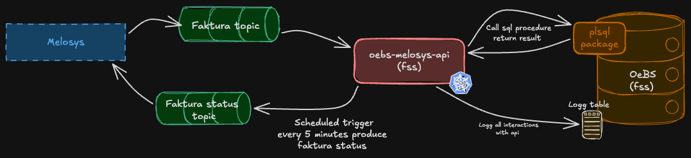

# oebs-melosys-api

Kafka bridge service that processes invoices from Melosys and sends invoice statuses back to Melosys via Kafka,
using the OEBS Oracle database as the processing backend.
The service runs in sikker sone (FSS) and acts as the integration layer between Melosys and OEBS for invoice handling.

---

## Architecture

The service acts as a bridge between Melosys (GCP) and the OEBS Oracle database (sikker sone).
Invoices produced in Melosys are sent to OEBS via Kafka, where they are processed and sent out to users.
Invoice statuses are sent back from OEBS to Melosys once a day, allowing Melosys to stay up to date on invoice state.
If an invoice fails to import, an error status is sent back immediately.

All inbound and outbound calls are logged to the OEBS database via `KallLogg`.

---

## Functionality

Two flows are handled:
- **Inbound:** Invoice messages from Melosys are consumed from Kafka and passed to the OEBS Oracle database via the PL/SQL procedure `apps.xxrtv_ar_melosys_pkg.fakturaimport`. If the import fails, an error status is immediately sent back to Melosys via the faktura-status topic.
- **Outbound:** A scheduled Quartz job queries the OEBS Oracle database via `apps.xxrtv_ar_melosys_pkg.fakturastatus` and publishes invoice statuses to Melosys via the faktura-status Kafka topic. The job runs every 5 minutes starting at 08:30, and also once on startup.

### Instances and environments

The service runs with three instances: t1, q1, and prod.

- **t1** runs in `dev-fss`, reading invoices from Melosys q1
- **q1** runs in `dev-fss`, reading invoices from Melosys q2
- **prod** runs in `prod-fss`, reading invoices from Melosys prod

**Note:** The environment coupling between OEBS and Melosys cannot be changed without coordinating with the Melosys team. Melosys primarily uses OEBS t1 for their testing.

Deployment order: **t1 → q1 → prod**. Production deployment requires manual trigger via `workflow_dispatch`.

### Kafka topics

| Topic | Format | Topic configuration | Description |
|-------|--------|---------------------|-------------|
| `teammelosys.faktura-bestilt.v1` | JSON | [melosys-iac](https://github.com/navikt/melosys-iac) | Invoices sent from Melosys to OEBS for processing |
| `team-oebs.faktura-status.v1` | JSON | [oebs-iac](https://github.com/navikt/oebs-iac) | Invoice statuses sent from OEBS back to Melosys |

### Invoice processing

1. An invoice message is consumed from the `faktura-bestilt` topic
2. The message is passed to the OEBS Oracle database via `apps.xxrtv_ar_melosys_pkg.fakturaimport`
3. On success, the offset is committed
4. On a known import error (`EXCEPTION`), an error status is immediately sent back to Melosys via the `faktura-status` topic, and the offset is committed
5. On an unknown database error, an exception is thrown (offset not committed)

### Invoice status job

A Quartz scheduler job (`ScheduledFakturaStatusProducer`) runs on a fixed schedule:

| Trigger | Schedule |
|---------|----------|
| On startup | Once, immediately |
| Recurring | Every 5 minutes, starting at 08:30 |

The job calls `apps.xxrtv_ar_melosys_pkg.fakturastatus`, splits the result line by line,
and publishes each invoice status individually to the `faktura-status` Kafka topic.

### OEBS PL/SQL package

Both procedures are part of the `xxrtv_ar_melosys_pkg` package in the OEBS Oracle database:

| File | Description |
|------|-------------|
| [xxrtv_ar_melosys_pkg.pks](https://github.com/navikt/oebs/blob/main/admin/sql/xxrtv_ar_melosys_pkg.pks) | Package specification — defines the public interface |
| [xxrtv_ar_melosys_pkg.pkb](https://github.com/navikt/oebs/blob/main/admin/sql/xxrtv_ar_melosys_pkg.pkb) | Package body — contains the implementation |

---

## Dependencies

| System | Purpose |
|--------|---------|
| **OEBS Oracle Database** | Processes inbound invoices via PL/SQL; source of invoice statuses; stores all call logs via `KallLogg` |
| **Melosys** | Sends invoices to the `faktura-bestilt` topic; receives invoice statuses from the `faktura-status` topic |
| **Aiven Kafka** | Message transport between Melosys (GCP) and this service (FSS) |
| **Quartz** | Clustered scheduler for the recurring invoice status job, backed by the OEBS Oracle database |
| **NAIS platform** | Container orchestration, secrets management, and deployment |

### Consumers
The only consumer of the `faktura-status` topic is Melosys. Changes to the message format must be coordinated with the Melosys team
in the slack channel [melosys-løst-oebs](https://nav-it.slack.com/archives/C03UZCM7RS5).

---

## Running Locally

Setup for running locally has not been configured yet, because the service requires
access to kafka topics. The T1 instance can be used for testing.

---

## Testing

Unit tests are set up using JUnit and Mockito.

---

## Monitoring and Alerting

No alerting is currently configured for this service. Alerting for the invoice flow is handled on the Melosys side.
Issues can be detected by observing `KallLogg` entries in the OEBS database, or through errors reported by Melosys.

Standard application monitoring is available via Grafana dashboards:
- [Grafana dashboard for t1](https://grafana.nav.cloud.nais.io/a/nais-apm-app/services/team-oebs/oebs-melosys-api-t1?namespace=team-oebs&environment=dev-fss)
- [Grafana dashboard for q1](https://grafana.nav.cloud.nais.io/a/nais-apm-app/services/team-oebs/oebs-melosys-api-q1?namespace=team-oebs&environment=dev-fss)
- [Grafana dashboard for prod](https://grafana.nav.cloud.nais.io/a/nais-apm-app/services/team-oebs/oebs-melosys-api?namespace=team-oebs&environment=prod-fss)

---

## Deploy

### Branching strategy
- Feature development should happen on dedicated branches with a PR to `main`.
- Merging to `main` triggers deployment to **T1 and Q1** automatically.
- Deployment to **production** requires a manual workflow dispatch with `deploy_prod: true`.

### Referencing Jira tasks
Include the Jira task key in the branch name and/or commit message. All PRs are squash-merged into main, so the most important thing is that the Jira issue is referenced in the squash commit message and that the PR title references the Jira issue. For example, if working on `OEBS-123`, the commit message should include `feat(OEBS-123): beskrivelse` and the PR title should follow the same format. If a PR covers multiple Jira issues, all should be referenced, e.g. `feat(OEBS-123, OEBS-124): beskrivelse`. All individual commits should be listed in the PR description.

### Promotion criteria
Before deploying to production:
- All tests must pass (`mvn verify`).

---

## Documentation

- [Melosys documentation](https://confluence.adeo.no/spaces/TEESSI/pages/431012462/Melosys+trygdeavgift) — Melosys internal documentation, includes a diagram showing the OEBS integration
- [Decision meeting](https://confluence.adeo.no/spaces/TEESSI/pages/478487910/Beslutningsunderlag+samhandling+Melosys+og+OEBS) — Background for why this service was built instead of using the existing tax system integration
- [Invoice field clarification](https://confluence.adeo.no/spaces/TEESSI/pages/478274543/Samhandling+Melosys+og+OEBS+-informasjonsutveksling)
- [Design document](https://confluence.adeo.no/spaces/TEESSI/pages/505513949/2022-11-01+M%C3%B8tereferat+-+Melosys+og+OEBS) — Note: written at the start of the project; topic names and some functionality have changed since then
- [Melosys test identifiers](https://confluence.adeo.no/spaces/TEESSI/pages/544324711/Testidenter+til+bruk+i+Melosys+mot+OeBS)

